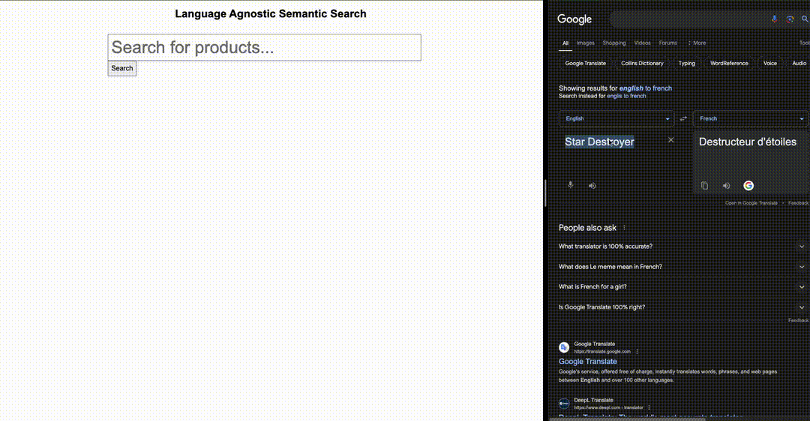

# Vector Search using ML transformer models
#### Demonstation of search using Language Agnostic transformer model.


## What Does this code do?
Indexing Data
 - Creates a document mapping to to create a search index. Includes vector properties, making sure to match the dimensions in the mapping with the dimensions of the transformer model we are using.
 - Runs the document data through the transformer model to create the vector embedding i.e "This is a sentence" => [-0.0297,0.0618,0.0240,-0.0288, ...]
 - Indexes the document with the vector embeddings.

 Searching data
 - Runs the query through the transformer model.
 - Formats your search query to use the generated vector embedding to perform a vector search
 - We are using a cosine similiarity function on the vector properties to get the results but this can be tweaked to adjust for query speed and accuracy.

## What Can we do with transformer models & vector search?
 - Improve standard keyword search by combining it with semantic search including:
    - [Natural language processing](https://huggingface.co/sentence-transformers/all-MiniLM-L6-v2). Get results based on intent & contextual meaning of the search query.
    - [Language Agnostic search](https://huggingface.co/sentence-transformers/use-cmlm-multilingual). Get relevant results, agnostic of the language of the text used to create the indexed embedding and of the language of the search query text.
 - [Image search](https://huggingface.co/sentence-transformers/clip-ViT-B-32). Create vector embeddings from images and perform search on them using a natural language text query.


## How to run
### Requirements
- Python3
- Docker Desktop
- ElasticSearch 8.14 ([How to install in Docker Locally](https://www.elastic.co/guide/en/elasticsearch/reference/current/run-elasticsearch-locally.html))
- A whole lot of free RAM


### First time set up
1) Rename .env.example to .env and modify constants to match your setup.
2) Run `pip install -r requirements.txt`
3) Start the Flask Server by running `python main.py`
4) Add products & generate embeddings by calling the /index route. i.e.

``` bash
curl -X POST "http://localhost:5050/index" -H "Content-Type: application/json" -d '{
  "product_id": 1,
  "spin": "SPIN12345",
  "product_title": "Sample Product",
  "clean_product_description": "This is a sample product description.",
  "category_title": "Sample Category",
  "category_description": "This is a description of the sample category.",
  "custom_category_text": "Custom text for category",
  "parent_title": "Parent Product",
  "product_tags": ["tag1", "tag2"],
  "product_configurations": [
    {
      "product_configuration_url": "http://example.com/config1",
      "product_configuration_id": 101,
      "product_configuration_display_name": "Config 1",
      "product_configuration_total_price": 19.99,
      "product_pictures": [
        {
          "product_picture_url": "http://example.com/pic1",
          "product_picture_id": 201,
          "picture_entity_id": 301,
          "priority": 1,
          "title": "Picture 1",
          "description": "Description for picture 1",
          "picture_id": 401
        }
      ]
    },
    {
      "product_configuration_url": "http://example.com/config2",
      "product_configuration_id": 102,
      "product_configuration_display_name": "Config 2",
      "product_configuration_total_price": 29.99,
      "product_pictures": [
        {
          "product_picture_url": "http://example.com/pic2",
          "product_picture_id": 202,
          "picture_entity_id": 302,
          "priority": 2,
          "title": "Picture 2",
          "description": "Description for picture 2",
          "picture_id": 402
        }
      ]
    }
  ]
}'
```

### Querying the index
1) While the flask server is still running, open search page in your browser by going to http://localhost:5050 (Use port that is in your .env file)
2) Enter a term in the box and hit search.

### Further Reading
 - [Using Ingest Pipleinelines in Elasticsearch to generate embeddings on document index.](https://www.elastic.co/search-labs/blog/how-to-deploy-nlp-text-embeddings-and-vector-search)
 - [Hybrid Search - Combine vector search with full text or keyword search ](https://www.elastic.co/guide/en/elasticsearch/reference/current/knn-search.html#_combine_approximate_knn_with_other_features)
 - [Fine Tune pretrained models with your own custom datasets](https://huggingface.co/docs/transformers/en/training)
 - [Create a custom model](https://huggingface.co/docs/transformers/v4.17.0/en/create_a_model)